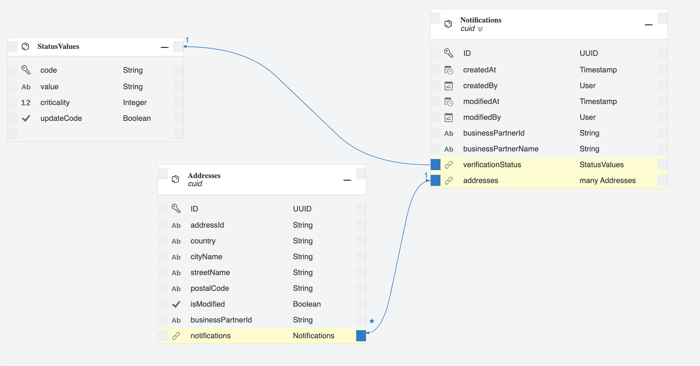

# Understand the Database Service

The database microservice is responsible for creating database tables, which are used for persisting the Business Partner details. This project uses the [`@sap/hdi-deploy`](https://www.npmjs.com/package/@sap/hdi-deploy) package to deploy the database artifacts to the SAP HANA Deployment Infrastructure (HDI) container.

## How Does It Work?

A service instance of SAP HANA Cloud is a prerequisite, which is needed to deploy the database artifacts.
HDI container is created in SAP HANA Cloud and a corresponding SAP HANA secret would be created in the SAP BTP, Kyma environment. The database artifacts are then deployed using a job to the HDI container using the credentials available in the SAP HANA secret.

## Database Tables That Are Used

This database module creates the following tables:
- Notifications
- Addresses
- StatusValues

### Notification

The Notification table is used to store the details of the Business Partners.

The following fields are part of this table:
- businessPartnerId
- businessPartnerName
- verificationStatus
- addresses

### Addresses

Business Partners addresses are stored in the Addresses table.

The following fields are part of this table:
- notifications
- addressId
- country
- cityName
- streetName
- postalCode
- isModified
- businessPartnerId

[CAP CDS definition of db tables can be found in this file](https://github.com/SAP-samples/btp-s4hana-kyma-business-process-extension/blob/main/db/schema.cds)

### StatusValues

The details of Status are stored in StatusValues table.

The following fields are part of this table:
- code
- value
- criticality
- updateCode
